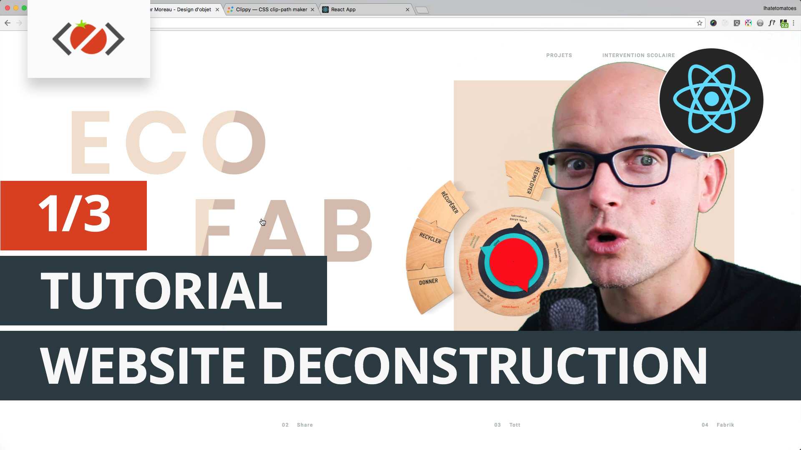

# React + CSS Clip Path Tutorial
Working files for my CSS Clip Path YouTube tutorial.

## Related Video
 

Add Video URLs

## How to use

* clone this repo
* run `npm install` to install all dependencies
* run `npm start` to build the project
* to compile SCSS to CSS open new terminal and run `npm run watch-css`
* visit `http://localhost:3000/` in the browser
* follow step by step

Have fun!

## Do you want more tutorials like this?

* [Subscribe to my channel](https://www.youtube.com/channel/UC7O6CntQoAI-wYyJxYiqNUg?sub_confirmation=1)
* [Subscribe to my email list](https://ihatetomatoes.net/the-best-of/)
